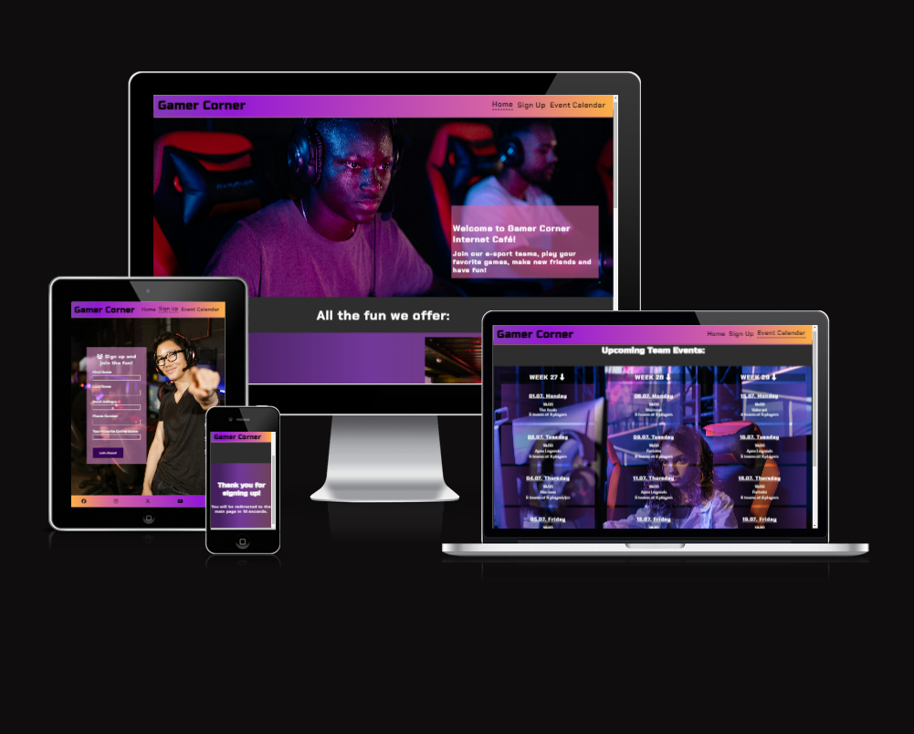
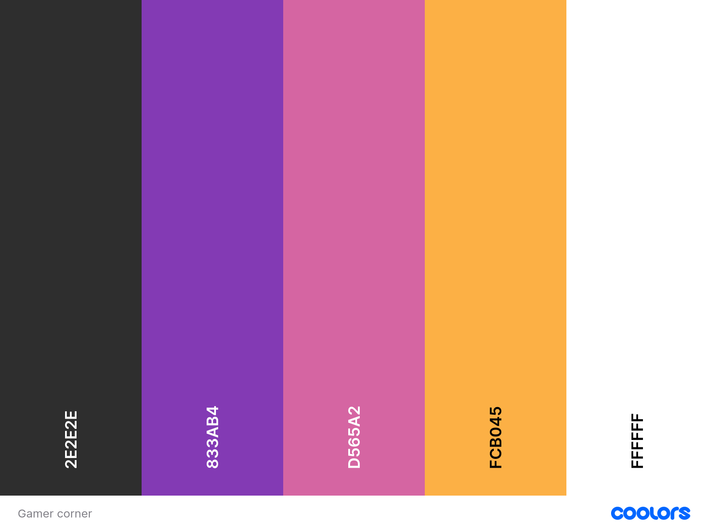

# Gamer Corner Website

The Gamer Corner website is designed to be responsive website allowing visitors to view on a range of devices. It allows visitors to find out about the Cafe and all the activities and services they offer.

[View Gamer Corner on Github pages](https://keszi94.github.io/gamer_corner/index.html)

- - -

## CONTENTS
 
* [User Experience](#user-experience-ux)
   * [Initial Discussion](#initial-discussion)
   * [User Stories](#user-stories)
 
 * [Design](#design)
   * [Colour Scheme](#colour-scheme)
   * [Typography](#typography)
   * [Imagery](#imagery)
   * [Wireframes](#wireframes)

   * [Features](#features)
   * [General Features on Each Page](#general-features-on-each-page)
   * [Future Implementations](#future-implementations)
   * [Accessibility](#accessibility)

* [Technologies Used](#technologies-used)
   * [Languages Used](#languages-used)
   * [Frameworks, Libraries & Programs Used](#frameworks-libraries--programs-used)

* [Deployment & Local Development](#deployment--local-development)
   * [Deployment](#deployment)
   * [Local Development](#local-development)
   * [How to Fork](#how-to-fork)
    * [How to Clone](#how-to-clone)

* [Testing](#testing)

* [Credits](#credits)
   * [Code Used](#code-used)
   * [Content](#content)
   * [Media](#media)
   * [Acknowledgments](#acknowledgments)

---

## User Experience (UX)

### Initial Discussion

Gamer Corner Cafe, located in Dublin is an Internet Cafe that markets themselves for people enjoying playig online games and meeting new people with the same interest. People interested can sign up to join a team in an upcoming event they are interested in.  
The Cafe also offers a variety of beverages that the guests can order from their desks using a program on their computers. 
The website's goal is to help everyone interested in e-sports see all the events and fun activities the Cafe can offer them. 

### Key information for the site

* What are the upcoming events scheduled for the next three weeks.
* The games avaliable to play within teams.
* A way for people to contact the Cafe for more in depth information.
* Providing an easy way to sign-up for future events and new teams.

## User Stories

#### Client Goals

* To be able to view the site on a range of device sizes.
* To make it clear for potential clients what games and services the Cafe provides.
* To make it easy for members to see upcoming events.  
* To allow people to be able to contact Gamer Corner Cafe for further informatin regarding services, events and offers. 

#### First Time Visitor Goals

* I want to find out what services the Cafe offers and how I can jon the community.
* I want to be able to navigate the site easily to find information.
* I want to be able to find them on various social media platforms.

#### Returning Visitor Goals

* I want to find up to date data on any upcoming events.
* I want to know their contact information in case I have more question about their services.

#### Frequent Visitor Goals

* I want to be able to sign up for my favorite game's upcoming team play event.

- - - 

## Design 

### Color Scheme

The website uses colors that resemble neon signs and RGB lights often used in modern gaming setups. The colour palette was created using the [Coolors](https://coolors.co/) website.

### Typography 

Google Fonts was used for the following fonts: 

* Chakra Petch is used for the body text on the site. It is a sans serif font.

* Russo One us used for the headings on the site. It is a sans serif font. 

### Imagery 

All featured photos were taken from various free stock photo websites. I have credited these in the [credits](#Credits) section.

### Wireframes

Wireframes were created for mobile, tablet and desktop.

[Home Page Wireframe](assets/images/readme-images/homepage.png)

[Sign Up Page Wireframe](assets/images/readme-images/signuppage.png)

[Upcoming Events Page Wireframe](assets/images/readme-images/upcomingeventspage.png)

### Features

The website is comprised of four pages, three of which are accessible from the navigation menu (home page, sign up page & upcoming events page). The fourth page is a thank you page which is shown once a user submits the form on the sign up page.

* All pages on the wbsite have:

 * A responsive navigation bar at the top which allows the user to navigate through the site. To the left of the navigation bar is the text Gamer Corner. To the right of the navigation bar are the links to the websites pages (home, sign up, upcoming events). 
    When viewing with mobile devices the navigation links change to a burger toggler. This was implemented to give the site a clean look and to promote a good user experience, as users are used to seeing the burger icon when on mobile devices to navigate a site.
    The navbar's dropdown menu has a solid background on the sign up and upcoming events pages to make the text visible over the text on the page behind it. The dropdown's background is transparent on the home page so that the picture behind it is not cut. 
 * A footer which contains social media icon links to instagram, facebook, tiktok, twitter and youtube. 
 * The Thank ypu page do not have links or a footer because the page automatically redirects to the home page after ten seconds. 

* Home page:
  
  * What We Offer Section. This section is broken down into three subsections: Arcade room, E-teams events and Cafe with table service. This section is meant to inform the wbsite's visitors about all the activities and services in the Cafe. 
  On large screens the first and third section have a gradient background to visually seperate all three sections and all three pictures are pushed to the right side of the screen to put the text more into focus. On smaller devices the pictures are positioned in the middle of the page, with the text placed above them. 
  * Contact Us Section. This section provides the following information: the Cafe's mobile number, email address and address. This section is meant to provide ways for visitors to cantact the Cafe if they need further information regarding the services and offers. 
  * Google Maps. At the bottom of the page, above the fooer is a map with the exact loaction of the Cafe to make it easier to find the location of it for first time visitors. 

* Sign up page:

  * 
 

### Accessibility

- - - 

## Technologies Used

### Languages Used

HTML and CSS were used to create this website.

### Frameworks, Libraries & Programs Used

Balsamiq - Used to create wireframes.

Github - To save and store the files for the website.

Google Fonts - To import the fonts used on the website.

Font Awesome - For the iconography on the website.

- - -

## Deployment & Local Development

### Deployment

Github Pages was used to deploy the live website.

